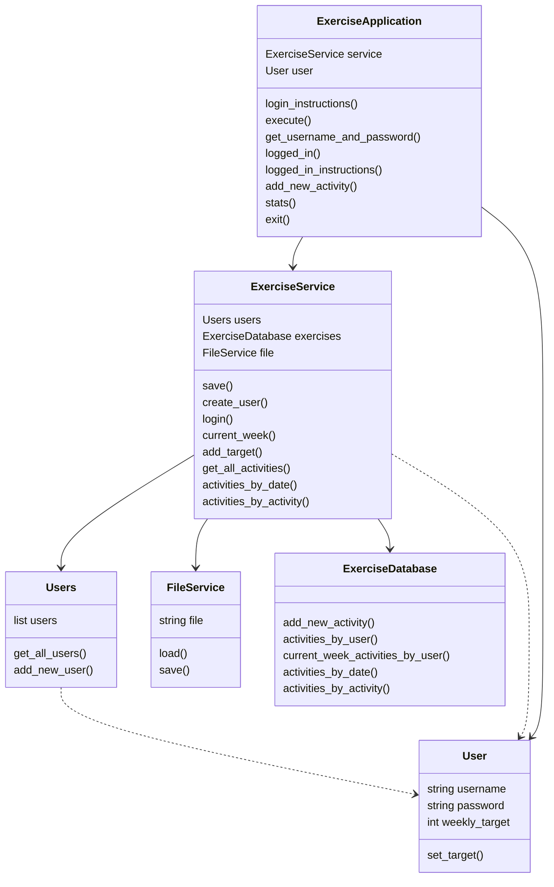
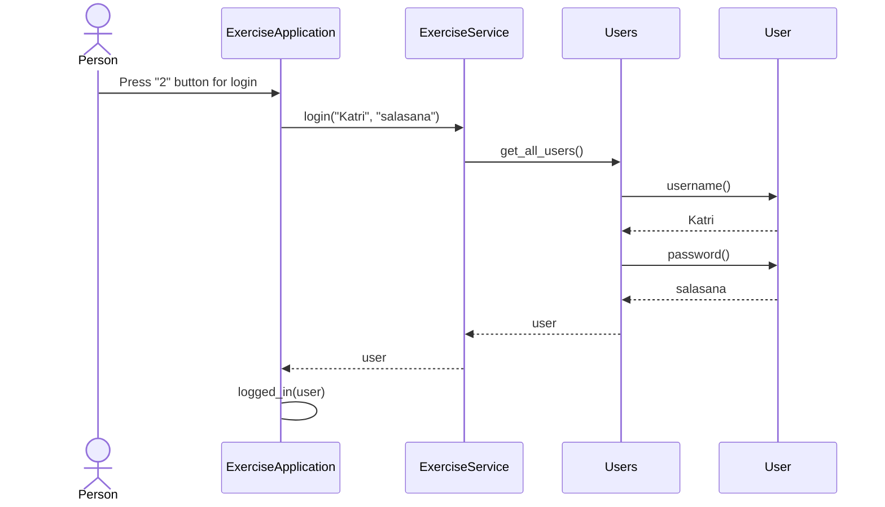

# Arkkitehtuurikuvaus

Sovelluksen kaikki koodi on samassa hakemistossa.  

## Luokkakaavio

Luokka ExerciseApplication vastaa käyttäjän kanssa kommunikoinnista ja luokka ExerciseService sovelluslogiikasta. Luokka ExerciseDatabase vastaa liikuntasuoritusten tallentamisesta tietokantaan ja liikuntasuorituksiin liittyvistä tietokantaoperaatioista. Luokka FileService vastaa tiedostonkäsittelystä eli käyttäjätietojen tallennuksesta tiedostoon ja näiden hakemisesta tiedostosta. Luokka User kuvaa yksittäistä käyttäjää ja luokka Users kuvaa kaikkia käyttäjiä.

## Käyttöliittymä

Luokka ExerciseApplication vastaa kaikesta kommunikoinnista käyttäjän kanssa. Käyttöliittymä sisältää kaksi eri tilaa, joissa käyttäjä voi valita toimintonsa:

- Aloitustila, jossa käyttäjä valitsee haluaako luoda uuden käyttäjätunnuksen, kirjautua sisään vai lopettaa sovelluksen käytön.
- Kirjautumistila, jossa käyttäjä valitsee, haluaako lisätä liikuntasuorituksen, nähdä viikottaiset suorituksensa, asettaa tavoitteen, nähdä tilastoja vai kirjautua ulos. Tilastojen katselu avaa oman tilansa, jossa käyttäjä voi hakea tilastoja eri tavoin. 

Käyttöliittymä kysyy käyttäjältä tarvittavia tietoja ja toteuttaa toiminnot kutsumalla ExerciseService -luokan metodeja.

## Sovelluslogiikka

Sovelluksen luokka Users kuvaa kaikkia käyttäjiä, luokka User kuvaa yskittäistä käyttäjää ja luokka ExerciseDatabase vastaa kaikkien käyttäjien liikuntasuoritusten tallennuksesta tietokantaan ja tietokantaoperaatioista. Toiminnallisuuksista näiden välillä vastaa luokan ExerciseService olio, joka sisältää metodit käyttöliittymän toiminnoille. Näitä metodeja ovat esimerkiksi: 

create_user(username, password)
login(username, password)
current_week(user)
get_all_activities(user)
add_target(user, target)

## Sekvenssikaavio

Kun käyttäjä painaa ohjelman käynnistyksen jälkeen painiketta "2" kirjautuakseen sisään jo luoduilla käyttäjätunnuksilla, kirjautuminen etenee seuraavasti:

