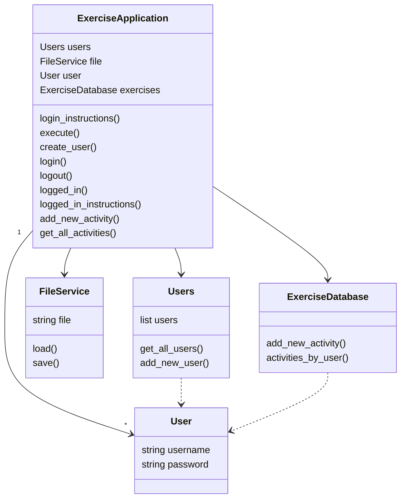

```mermaid
 classDiagram
      ExerciseApplication --> ExerciseDatabase
      ExerciseApplication --> FileService
      ExerciseApplication --> Users
      ExerciseApplication "1" --> "*" User
      Users ..> User
      ExerciseDatabase ..> User
      
      class ExerciseApplication {
        Users users
        FileService file
        User user
        ExerciseDatabase exercises
        login_instructions()
        execute()
        create_user()
        login()
        logout()
        logged_in()
        logged_in_instructions()
        add_new_activity()
        get_all_activities()
      }

      class Users {
        list users
        get_all_users()
        add_new_user()
      }

      class User {
        string username
        string password
      }
      class FileService {
        string file
        load()
        save()
      }
      class ExerciseDatabase {
        add_new_activity()
        activities_by_user()
      }
     
```
