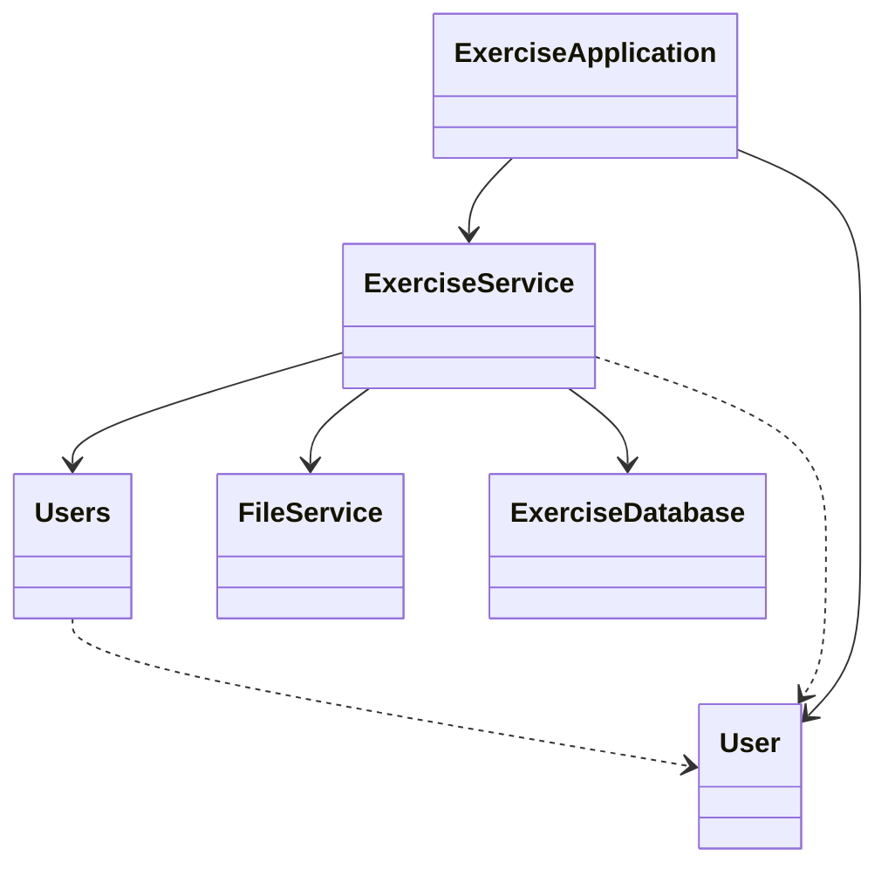
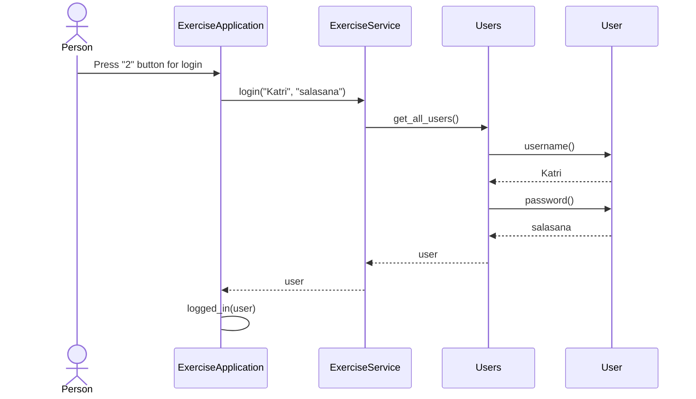

# Arkkitehtuurikuvaus

Sovelluksen kaikki koodi on samassa hakemistossa.  

## Luokkakaavio

Luokka ExerciseApplication vastaa käyttäjän kanssa kommunikoinnista ja luokka ExerciseService sovelluslogiikasta. Luokka ExerciseDatabase vastaa liikuntasuoritusten tallentamisesta tietokantaan ja liikuntasuorituksiin liittyvistä tietokantaoperaatioista. Luokka FileService vastaa tiedostonkäsittelystä eli käyttäjätietojen tallennuksesta tiedostoon ja näiden hakemisesta tiedostosta. Luokka User kuvaa yksittäistä käyttäjää ja luokka Users kuvaa kaikkia käyttäjiä.

## Käyttöliittymä

Luokka ExerciseApplication vastaa kaikesta kommunikoinnista käyttäjän kanssa. Käyttöliittymä sisältää kaksi eri tilaa, joissa käyttäjä voi valita toimintonsa:

- Aloitustila, jossa käyttäjä valitsee haluaako luoda uuden käyttäjätunnuksen, kirjautua sisään vai lopettaa sovelluksen käytön.
- Kirjautuneen käyttäjän tila, jossa käyttäjä valitsee, haluaako lisätä liikuntasuorituksen, nähdä viikottaiset suorituksensa, asettaa tavoitteen, nähdä tilastoja vai kirjautua ulos. 

Käyttöliittymä kysyy käyttäjältä tarvittavia tietoja ja toteuttaa toiminnot kutsumalla ExerciseService -luokan metodeja. Tilastojen katselu avaa oman alitilansa, jossa käyttäjä voi hakea tilastoja eri tavoin. 

## Sovelluslogiikka

Sovelluksen käynnistysksen yhteydessä luodaan luokan ExerciseService ainoa olio. ExerciseService -luokka sisältää kaikille käyttöliittymän toiminnoille oman metodin. Näitä metodeja ovat esimerkiksi: 

- create_user(username, password)
- login(username, password)
- add_new_activity(user, activity, date, duration)
- current_week(user)
- get_all_activities(user)
- activities_by_activity(user, activity)
- activities_by_date(user, datefrom, dateto)
- add_target(user, target)

ExerciseService -luokan metodit voivat kutsua muiden luokkien metodeja. Esimerkiksi metodi save(), kutsuu tiedoston käsittelystä vastaavan FileService -luokan metodia tallentaaksen tiedot tiedostoon. 

## Tietojen pysyväistallennus

Luokat FileService ja ExerciseDatabase huolehtivat tietojen pysyväistallennuksesta. FileService -luokka tallentaa käyttäjien tiedot (käyttäjätunnus, salasana, viikkotavoite) CSV -tiedostoon ja ExerciseDatabase -luokka tallentaa käyttäjien liikuntasuoritukset SQLite -tietokantaan.

### Tiedosto

Sovellus tallettaa käyttäjien tiedot tiedostoon. Tiedoston nimi määritellään koodin sisällä ExerciseServise luokan parametrina ja tiedosto luodaan sovelluksen käynnistyksen yhteydessä file_service.py -tiedostossa. Tiedoston nimi on oletusarvoisesti "users.txt".

Sovellus tallettaa tehtävät CSV-tiedostoon seuraavassa formaatissa:

Irmeli;tämäonsalasana;None
Pertti;tämäkinonsalasana;3

Eli käyttäjätunnus, salasana ja viikkotavoite (mikäli se on määritelty). Kenttien arvot erotellaan puolipisteellä (;).

### SQLite-tietokanta

Käyttäjien liikuntasuoritukset tallennetaan SQLite-tietokannan tauluun Activities, joka alustetaan exercise_database.py -tiedostossa sovelluksen käynnistyksen yhteydessä.

## Esimerkki toimintalogiikasta

Kuvataan seuraavaksi sovelluksen toimintalogiikkaa esimerkin kautta sekvenssikaaviona.

### Käyttäjän kirjautuminen

Kun käyttäjä painaa ohjelman käynnistyksen jälkeen painiketta "2" kirjautuakseen sisään jo luoduilla käyttäjätunnuksilla, kirjautuminen etenee seuraavasti:

Kun käyttäjä on painanut painiketta "2" kirjautuakseen sisään, käyttäliittymä kysyy käyttäjätunnusta ja salasanaa. Tämän jälkeen käyttöliittymä kutsuu ExerciseService -luokan metodia login() antaen parametriksi käyttäjän antamat käyttäjätunnus- ja salasanasyötteet. ExerciseService kutsuu Users -luokan metodia get_all_users() ja tarkastaa täsmääkö syötetty käyttätunnus mihinkään jo olemassa olevaan tunnukseen ja tämän jälkeen täsmääkö salasana. Jos käyttäjätunnus ja salasana täsmäävät, kirjautuminen onnistuu ja käyttöliittymä kutsuu omaa metodiaan logged_in(), joka saa parametrikseen kirjautuneen käyttäjän. 
