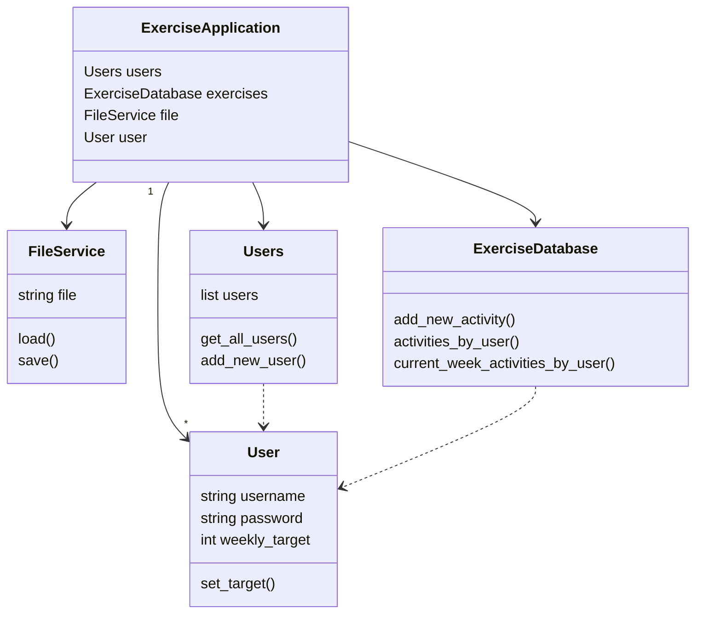
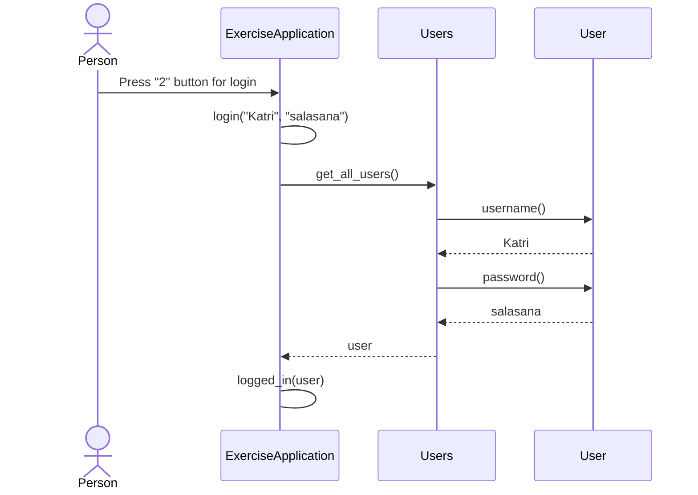

# Luokkakaavio

```mermaid
 classDiagram
      ExerciseApplication --> FileService
      ExerciseApplication --> Users
      ExerciseApplication --> ExerciseDatabase
      ExerciseApplication "1" --> "*" User
      Users ..> User
      ExerciseDatabase ..> User
      
      
        
      class ExerciseApplication {
        Users users
	ExerciseDatabase exercises
        FileService file
        User user
      }

      class Users {
        list users
        get_all_users()
        add_new_user()
      }

      class User {
        string username
        string password
        int weekly_target
        set_target()

      }
      class FileService {
        string file
        load()
        save()
      }
      class ExerciseDatabase {
        add_new_activity()
        activities_by_user()
        current_week_activities_by_user()
      }
     
```

# Sekvenssikaavio

Kun käyttäjä painaa ohjelman käynnistyksen jälkeen painiketta "2" kirjautuakseen sisään jo luoduilla käyttäjätunnuksilla, kirjautuminen etenee seuraavasti:

```mermaid
sequenceDiagram
  actor Person
  participant ExerciseApplication
  participant Users
  participant User
  Person->>ExerciseApplication: Press "2" button for login
  ExerciseApplication->ExerciseApplication: login("Katri", "salasana")
  ExerciseApplication->>Users: get_all_users()
  Users->>User: username()
  User-->>Users: Katri
  Users->>User: password()
  User-->>Users: salasana
  Users-->>ExerciseApplication: user
  ExerciseApplication->ExerciseApplication: logged_in(user)
```
