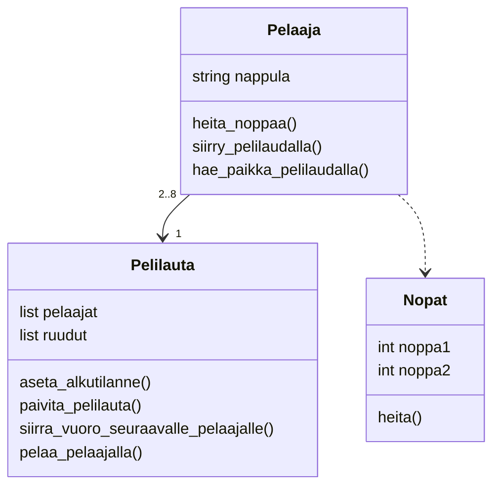

```mermaid
 classDiagram
      Pelaaja "2..8" --> "1" Pelilauta
      Pelaaja ..> Nopat
      
      
      class Pelaaja{
        string nappula
        heita_noppaa()
        siirry_pelilaudalla()
        hae_paikka_pelilaudalla()
        
      } 
      class Pelilauta {
        list pelaajat
        list ruudut
        aseta_alkutilanne()
        paivita_pelilauta()
        siirra_vuoro_seuraavalle_pelaajalle()
        pelaa_pelaajalla()
          
      }
      class Nopat {
       int noppa1
       int noppa2
       heita()
       }
     
```
