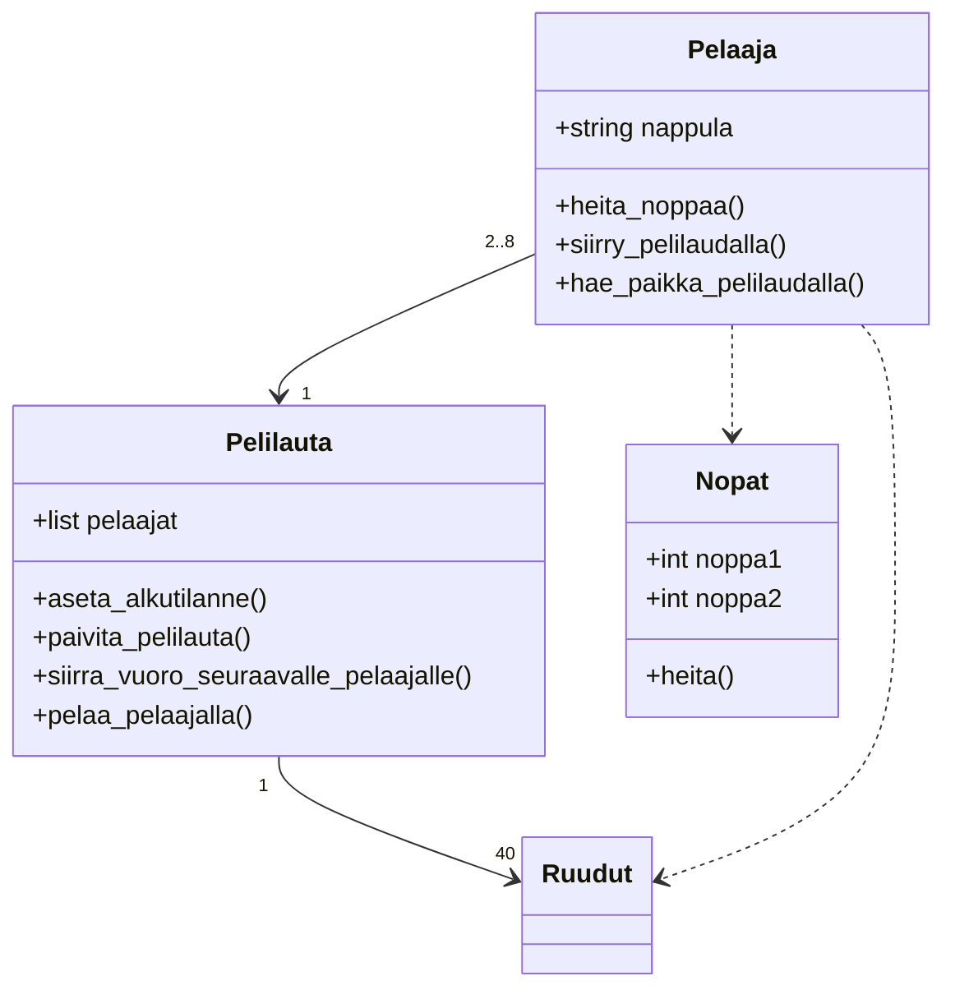

```mermaid
 classDiagram
      Pelaaja "2..8" --> "1" Pelilauta
      Pelilauta "1" --> "40" Ruudut
      Pelaaja ..> Nopat
      Pelaaja ..> Ruudut
      
      class Pelaaja{
        +string nappula
        +heita_noppaa()
        +siirry_pelilaudalla()
        +hae_paikka_pelilaudalla()
        
      } 
      class Pelilauta {
        +list pelaajat
        +aseta_alkutilanne()
        +paivita_pelilauta()
        +siirra_vuoro_seuraavalle_pelaajalle()
        +pelaa_pelaajalla()
          
      }
      class Nopat {
       +int noppa1
       +int noppa2
       +heita()
       }
     
```
