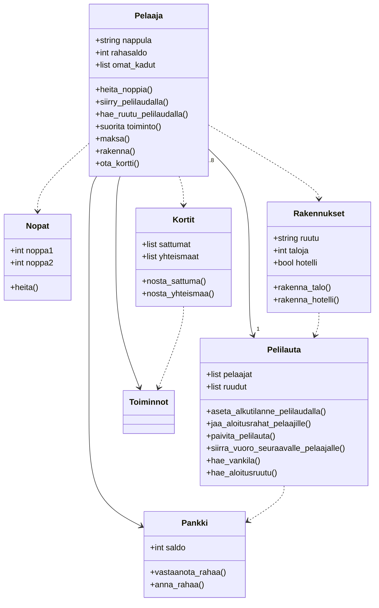

```mermaid
 classDiagram
      Pelaaja "2..8" --> "1" Pelilauta
      Pelaaja ..> Nopat
      Pelaaja --> Toiminnot
      Pelaaja --> Pankki
      Rakennukset ..> Pelilauta
      Pelaaja ..> Rakennukset
      Pelaaja ..> Kortit
      Kortit ..> Toiminnot
      Pelilauta ..> Pankki
     
      
      class Pelaaja{
        +string nappula
        +int rahasaldo
        +list omat_kadut
        +heita_noppia()
        +siirry_pelilaudalla()
        +hae_ruutu_pelilaudalla()
        +suorita toiminto()
        +maksa()
        +rakenna()
        +ota_kortti()
        
      } 
      class Pelilauta {
        +list pelaajat
        +list ruudut
        +aseta_alkutilanne_pelilaudalla()
        +jaa_aloitusrahat_pelaajille()
        +paivita_pelilauta()
        +siirra_vuoro_seuraavalle_pelaajalle()
        +hae_vankila()
        +hae_aloitusruutu()
      }

      class Nopat {
        +int noppa1
        +int noppa2
        +heita()
      }
      class Rakennukset {
        +string ruutu
        +int taloja
        +bool hotelli
        +rakenna_talo()
        +rakenna_hotelli()
      }
      class Kortit {
        +list sattumat
        +list yhteismaat
        +nosta_sattuma()
        +nosta_yhteismaa()
        
      }
      class Pankki {
        +int saldo
        +vastaanota_rahaa()
        +anna_rahaa()
      }
        
     
```
