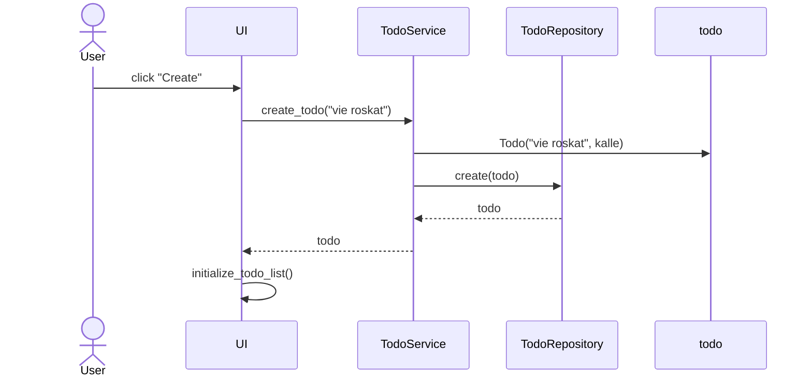

sequenceDiagram
    participant main
    participant kone
    Alice->>John: Machine()

    Note right of John: Rational thoughts  prevail!
    John-->>Alice: Great!
    John->>Bob: How about you?
    Bob-->>John: Jolly good!
