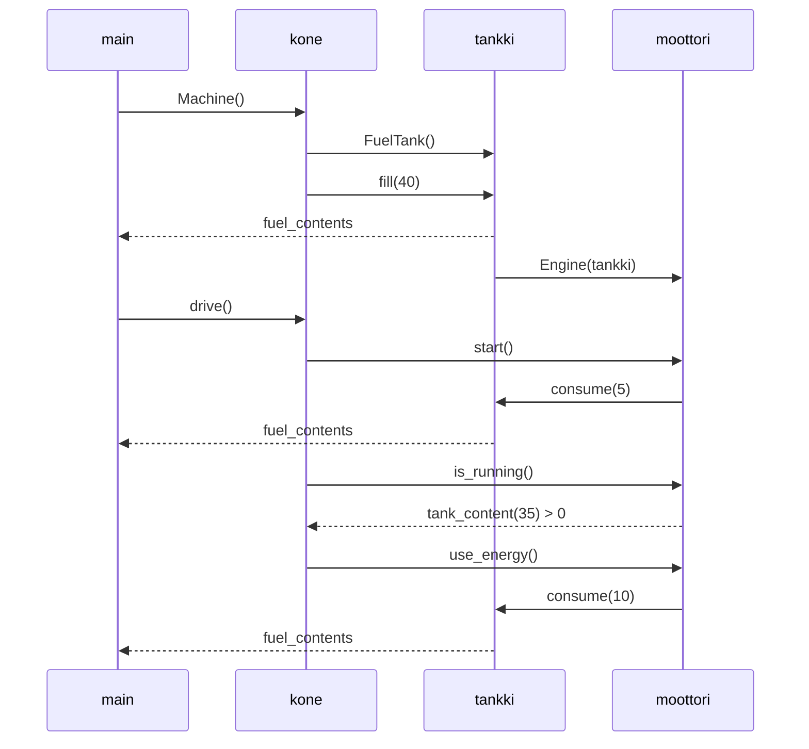

```mermaid
sequenceDiagram
  participant main
  participant kone
  main->>kone: Machine()
  participant tankki
  kone->>tankki: FuelTank()
  kone->>tankki: fill(40)
  tankki-->>main: fuel_contents
  participant moottori
  tankki->>moottori: Engine(tankki)
  main->>kone: drive()
  kone->>moottori: start()
  moottori->>tankki: consume(5)
  tankki-->>main: fuel_contents
  kone->>moottori: is_running()
  moottori-->>kone: tank_content(35) > 0
  kone->>moottori: use_energy()
  moottori->>tankki: consume(10)
  tankki-->>main: fuel_contents

```
